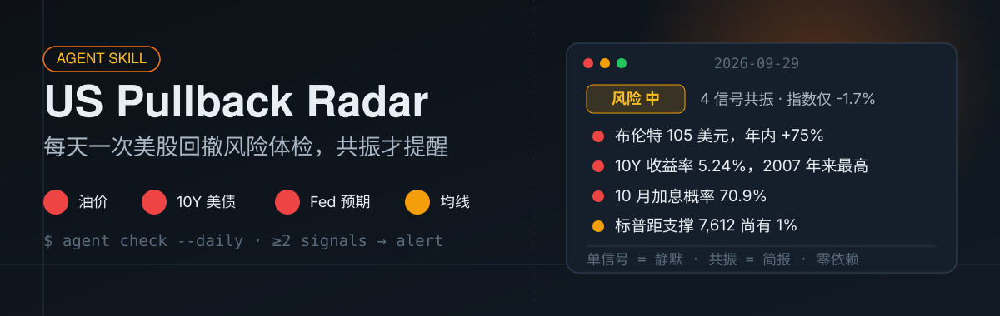

<div align="center">



[](LICENSE)
[](SKILL.md)
[](#怎么安装自然语言不需要命令行)

</div>

# US Pullback Radar · 美股回撤雷达

一个**纯分析的 agent skill**——不是 bot，没有服务端，没有依赖。它把一套经过实战校准的美股风险分析方法教给你的 AI agent：每天六类信号逐项体检，红黄绿灯分级，**只有多信号共振时才开口提醒**，其余时间保持安静。

**一次真实的输出**（2026-09-29，见 [samples/](samples/)）：油价冲高 + 10Y 收益率创 2007 年来新高 + 加息预期升温 + 市场广度恶化——四个信号共振，但指数只回撤 1.7%。结论：风险等级「中」，升级早期预警，而非下跌确认。这正是这套规则的价值：**既不放过风险累积，也不被单日噪音吓出局**。

## 六类信号

| # | 信号 | 红灯长什么样 |
|---|---|---|
| 1 | 油价 | 布伦特 >100 美元且快速上行，或地缘供给冲击 |
| 2 | 10Y 美债收益率 | 创多年新高；盈利收益率被反超 |
| 3 | S&P 500 均线 | 有效跌破 50 日线或关键支撑 |
| 4 | 宏观数据 | 核心通胀环比 ≥0.3%、就业骤降 |
| 5 | Fed 预期 | 加息重启且概率 >60%、降息预期大幅收敛 |
| 6 | AI 巨头财报 | 超级财报周临近 + 板块大跌/负面指引 |

完整阈值、数据来源和边界情况（同源信号合并、假突破识别）在 [references/signals.md](references/signals.md)。

## 核心规则：共振才提醒

```
全绿 / 仅 1 黄        → 低风险   → 静默，一行「今日检查完成」
仅 1 红               → 正常波动 → 静默，内部记录
≥2 红共振             → 中风险   → ≤300 字风险简报
回撤 >5% 或触发线击穿  → 高风险   → 简报 + 应对选项
```

为什么？因为美股回撤极少是单一原因造成的，而单一信号的恶化大多是噪音。这套过滤规则能把「每天 20 条恐慌推送」变成「一个月 2-3 次真正值得看的提醒」。

## 怎么安装（自然语言，不需要命令行）

把本仓库给任何智能体，说人话就行：

**WorkBuddy / Claude Code / Codex 等编码智能体**——

> 「按 github.com/zackzhangkai/us-pullback-radar-skill 里的 SKILL.md 执行一次美股回撤风险检查」

想每天自动跑，加一句：

> 「以后每天晚上 10 点按那个 SKILL.md 跑一次美股风险检查，共振才提醒我」

**ChatGPT 等对话智能体**——把 SKILL.md 正文贴进自定义指令 / Projects 说明，然后每天说一句「执行今日美股风险检查」。

定时任务的详细配置（crontab / automation prompt 模板）在 [references/automation.md](references/automation.md)。

## 目录结构

```
us-pullback-radar-skill/
├── SKILL.md                    # skill 入口：检查清单、判定规则、简报格式、安装说明
├── references/
│   ├── signals.md              # 六信号的阈值、来源与边界情况
│   ├── report-format.md        # 完整报告的 JSON/Markdown 格式
│   └── automation.md           # 每日自动化安装模板（各智能体）
├── samples/                    # 一次真实输出的完整样例（JSON + HTML 报告）
└── assets/                     # README 视觉素材
```

## 不只是美股

检查清单是可替换的：同样的「信号 → 分级 → 共振 → 静默/提醒」框架，换一组指标就能盯黄金、比特币、汇率或任何资产。框架本身在 SKILL.md 里，改起来不难。

## 社区

我是 Zack，独立开发者，一个人做产品。用得顺手、有想法、或有别的玩法，欢迎来聊：

| 微信（加我） | AI 学习交流圈（微信群） | X (Twitter) |
|---|---|---|
|  |  | [@kaiz_amm](https://x.com/kaiz_amm) |

- 微信号：`zk_0123456789`
- 群内常聊：AI 编程、独立开发、AI agent 工作流

我的其他开源项目：

| 项目 | 说明 |
|---|---|
| [AIHOT](https://github.com/zackzhangkai/AIHOT) | 自己找热点、自己写日报的网站框架 |
| [ai-agent-tutorial](https://github.com/zackzhangkai/ai-agent-tutorial) | 《AI Agent 全栈实战》配套代码，[CoderFather](https://coderfather.com) 第一本书 |
| [scys-radar](https://github.com/zackzhangkai/scys-radar) | 生财有术 MCP 雷达，在 Obsidian 里刷生财 |
| [wechat-workbench](https://github.com/zackzhangkai/wechat-workbench) | 公众号发布工作台：Markdown 进，草稿箱出 |

写 AI 实战与独立开发，公众号「**Zack说AI**」。

## License

[MIT](LICENSE) © [Zack](https://github.com/zackzhangkai)

---

<sub>**In English:** US Pullback Radar is a pure-analysis agent skill — no bot, no server, no dependencies. It teaches your AI agent a battle-tested daily risk check for US equities: six signal categories (oil, 10Y Treasury, S&P 500 moving averages, macro data, Fed expectations, mega-cap earnings) graded red/amber/green, with alerts only when **two or more independent signals fire together**. Install by pointing any coding agent at the repo, or paste SKILL.md into custom instructions. Samples include a real run from 2026-09-29 where four signals converged while the index was down only 1.7%.</sub>
